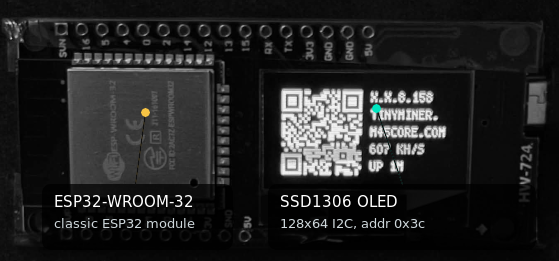
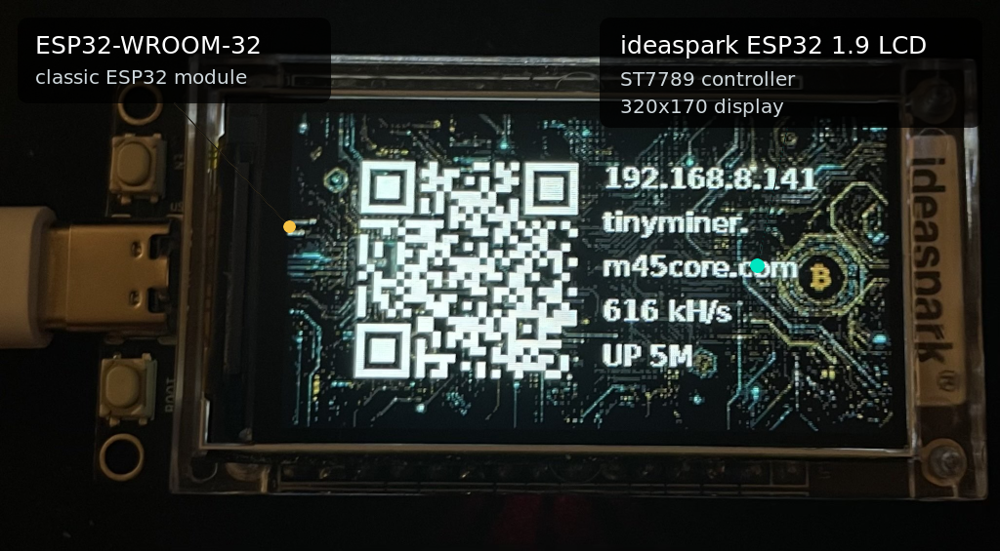
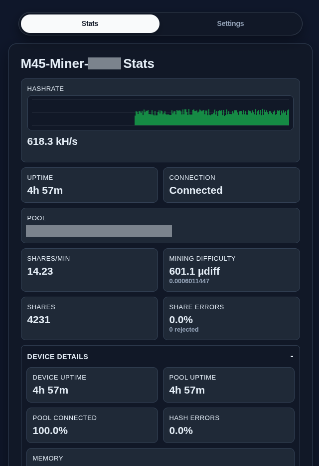
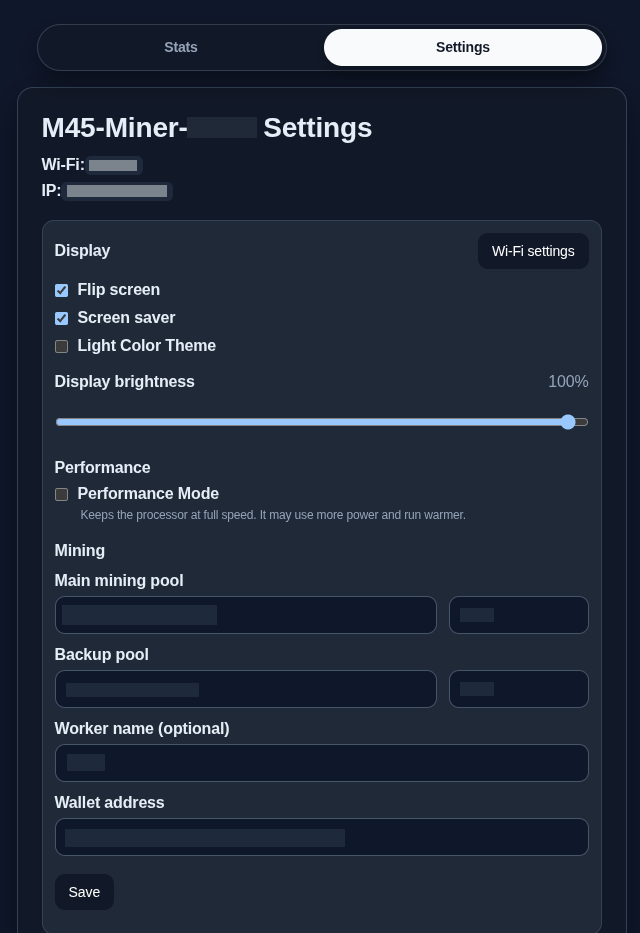

## M45-Core-Firmware

[](LICENSE)
[](https://github.com/Distortions81/M45-Core-Firmware/releases)
[](https://github.com/Distortions81/M45-Core-Firmware/actions/workflows/release-firmware.yml)
[](https://github.com/espressif/esp-idf/releases/tag/v5.5.3)
[](https://www.espressif.com/en/products/socs/esp32)

## Currently Supported Hardware

- Chip: ESP32-WROOM-32, classic ESP32 target.
- Default display: SSD1306 128x64 I2C OLED, address 0x3c ([Amazon](https://www.amazon.com/dp/B0BFDHWZB8)).
- LCD build display: ideaspark ESP32 1.9 inch LCD with ST7789 controller, 320x170 ([Amazon](https://www.amazon.com/dp/B0D6QXC813)).
- These boards are often available for less from other sites.

- Average mining speed: 620 kH/s, April 2026.
- 740 KiB binary
- 108 KiB IRAM, 62 KiB DRAM
- Source size: roughly 10k LoC
- Hardware: ESP32-WROOM-32

| OLED Display | ideaspark 1.9 inch LCD | Web Stats | Web Settings |
| --- | --- | --- | --- |
|  |  |  |  |

[web firmware flash tool](https://distortions81.github.io/M45-Core-Firmware/).

## Requirements

- Official ESP-IDF checkout, tested with ESP-IDF v5.5.3.
- Python 3.
- Pillow only when building LCD image/font assets for the ideaspark LCD target.

Install or verify ESP-IDF:

```sh
./scripts/setup-esp-idf.sh
./scripts/check-environment.sh
```

## Build

Default firmware:

```sh
./scripts/build-firmware.sh
```

ideaspark ESP32 1.9 inch LCD firmware:

```sh
./scripts/build-firmware.sh --ideaspark-19-lcd
```
