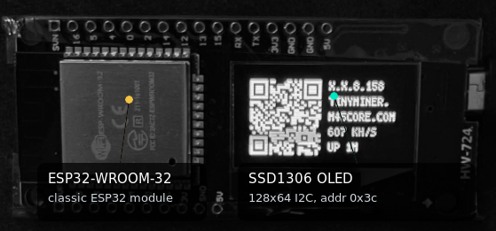
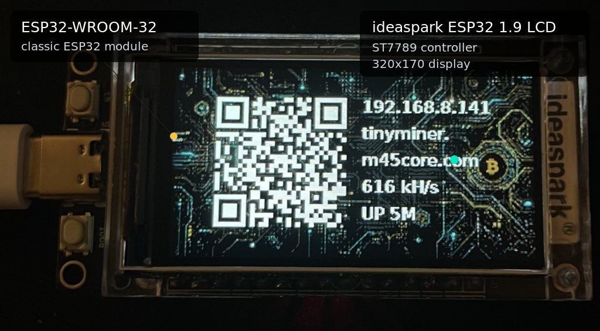
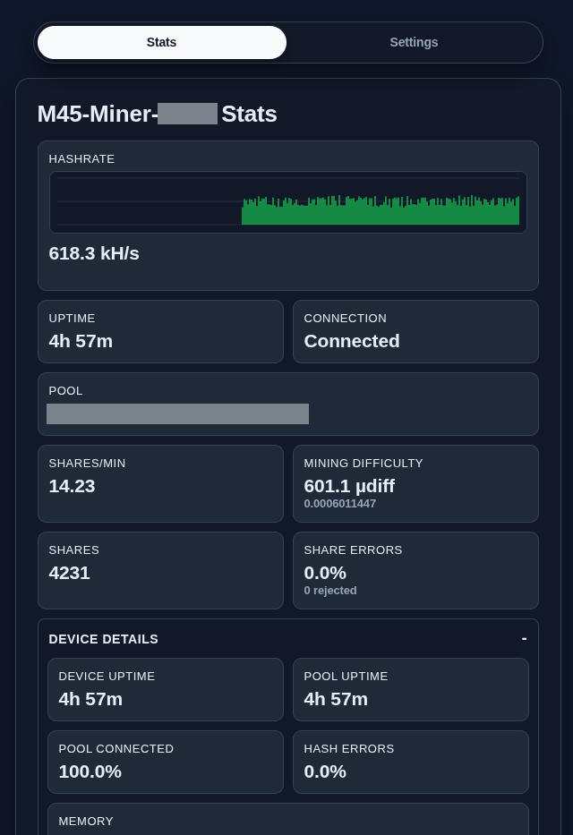
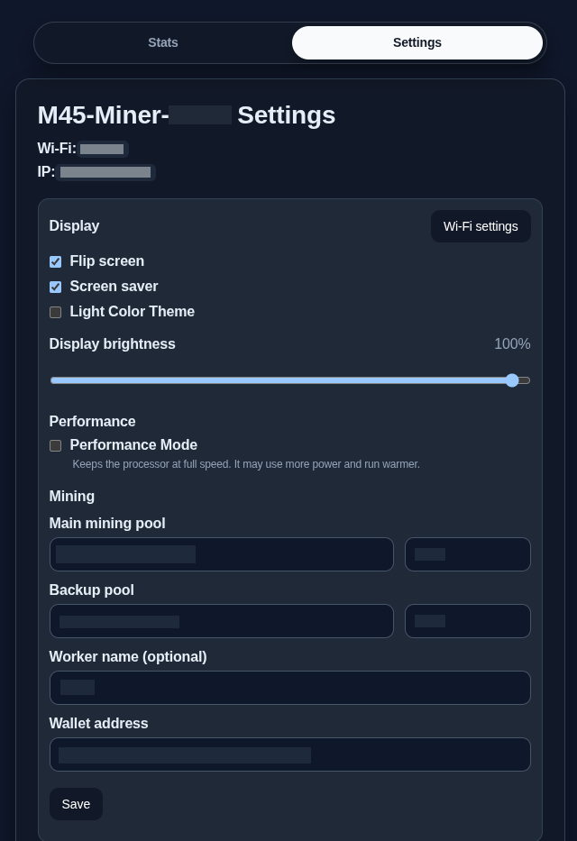

# M45 Core Firmware

M45 Core turns a supported ESP32 display board into a small, standalone
Bitcoin lottery miner. It connects to your Wi-Fi and mining pool, shows live
mining information on its screen, and has a simple settings page you can open
from your phone or computer.

On supported hardware, it averages about **620 kH/s**. Mining rewards are not
guaranteed.

## Choose the Right Board

The ready-to-use firmware supports these two classic ESP32 boards:

| Screen | Supported hardware | Store | Price |
| --- | --- | --- | ---: |
| OLED | ESP32-WROOM-32 with a 128x64 SSD1306 OLED wired to pins 5 and 4 | [AliExpress](https://www.aliexpress.us/item/3256807345345946.html) | US $0.99–$7.00 |
| OLED | ESP32-WROOM-32 with a 128x64 SSD1306 OLED wired to pins 5 and 4 | [Amazon](https://www.amazon.com/dp/B0BFDHWZB8) | US $11.99 |
| LCD | ideaspark ESP32-WROOM-32 with a 1.9-inch, 320x170 ST7789 display | [Amazon](https://www.amazon.com/dp/B0D6QXC813) | US $15.99 |

Board listings often look very similar. The ready-to-use firmware does **not**
support ESP32-C3, ESP32-S3, ESP32-1732S019, or OLED boards wired to pins 21 and
22. Check the chip and display details before ordering.

Prices and board revisions can change, so confirm the listing details before
you buy.

## Get Started

You need a supported board, a USB data cable, and a desktop computer running
Chrome or Edge.

1. Connect the board to your computer with USB.
2. Open the **[M45 Core browser flasher](https://m45core.github.io/M45-Core-Firmware/)**.
3. Choose the firmware that matches your screen: **OLED** or **LCD**.
4. Click **Flash Firmware** and select your board's serial connection.
5. When flashing finishes, wait for the setup Wi-Fi name and address to appear
   on the board's screen.
6. On your phone or computer, join the Wi-Fi network named something like
   `m-ABCD`.
7. Open the address shown on the screen and enter your home Wi-Fi details.

The board will restart and connect to your home Wi-Fi. Open the new address
shown on its screen to enter your wallet and pool settings or view mining
stats.

For upgrades and other flashing methods, see the
**[flashing guide](docs/FLASHING.md)**.

## What You Can Do

- See live hashrate, shares, pool status, best share, and block-found alerts.
- Change Wi-Fi, pool, wallet, display, and performance settings from a web
  browser.
- Use a main and backup mining pool.
- Adjust screen brightness, theme, orientation, and sleep time.
- Keep your settings when installing an update with the browser flasher.

| OLED display | 1.9-inch LCD | Web stats | Web settings |
| --- | --- | --- | --- |
|  |  |  |  |

[Watch the example block-found screens](https://www.youtube.com/watch?v=FBJSWs7Cxi0).

## Using the Device

- Open the IP address shown on the screen to see stats and settings.
- Press the **BOOT** button briefly to move between display pages.
- Hold **BOOT** for 5 seconds to erase saved settings and start setup again.
- To change Wi-Fi, open the device's web settings page and choose **Wi-Fi**.

The **[device usage guide](docs/USAGE.md)** has more detail about mining,
display settings, and factory resets.

## If Something Goes Wrong

- Make sure you are using Chrome or Edge on a desktop computer.
- Make sure your USB cable supports data, not only charging.
- If flashing cannot connect, hold **BOOT** while the flasher tries again.
- If the board keeps its old settings, flash again with
  **Reset WiFi and pool settings** selected.
- Double-check that your board is one of the supported models above.

More solutions are in the **[flashing guide](docs/FLASHING.md#troubleshooting)**.

## For Developers

Building from source requires the official ESP-IDF toolchain. See the
**[script and build guide](scripts/README.md)** for setup, build, flash,
monitoring, and benchmark commands. ESP32-S3 is available only as a slower
source-build compatibility target; it is not supported by the release images.

TLS is currently disabled to conserve memory. See [TLS support notes](TLS-support.md)
for technical details.

## License

M45 Core Firmware is released under the MIT License. See [LICENSE](LICENSE),
[ATTRIBUTION.md](ATTRIBUTION.md), and [THIRD_PARTY_NOTICES.md](THIRD_PARTY_NOTICES.md).
